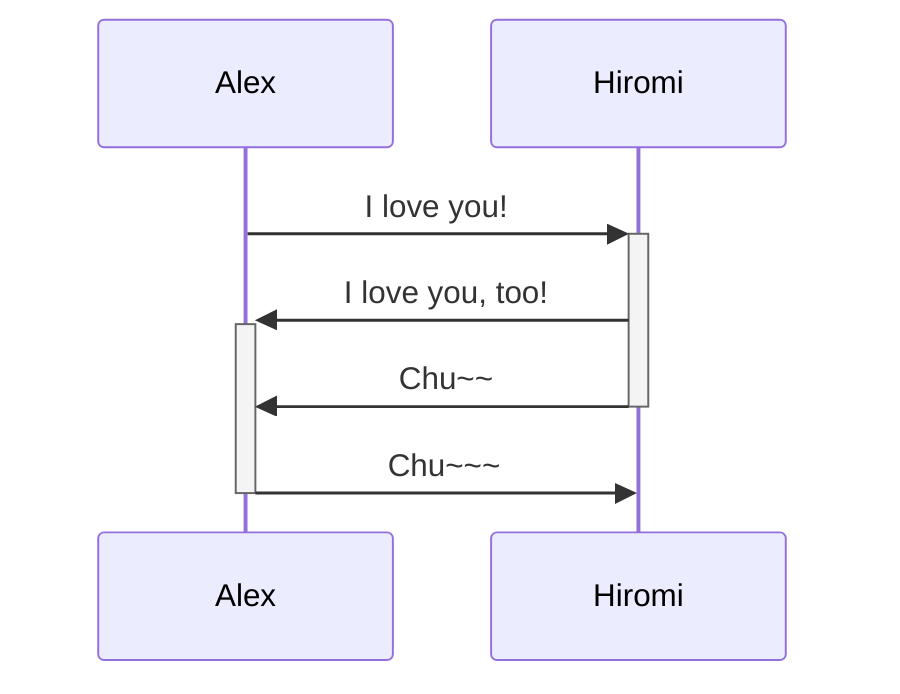
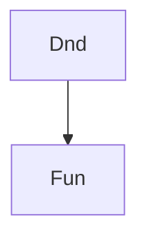

To create a heading, add up to six `#` symbols before your heading text. The number of `#` symbols determines the size of the heading.

# This is a heading 1 
## This is a heading 2 
### This is a heading 3 
#### This is a heading 4 
##### This is a heading 5 
###### This is a heading 6

## Styling Text

**Bold** `**`
*italics* `*`
~~strikethrough~~ `~~`
==Highlight== ``==
**Bold text and _nested italics_  text**
***bold and italics*** `***`

## Quotes

> Human beings face ever more complex and urgent problems, and their effectiveness in dealing with these problems is a matter that is critical to the stability and continued progress of society. 
\- Doug Engelbart, 1961

## Code

Text inside `backticks` on a line will be formatted like code

```
Code block triple back ticks
```

```rust
println!('Hello, World');
let temp = moo;
```

## External Links

To link a URL create inline link with ( [ ] ) then URL in ( ( ) )

[Obsidian Help](https://help.obsidian.md)

External link to files in other vaults using Obsidian URI

[Kai'sa](obsidian://open?vault=NyshakVault&file=Kai'sa.md)

Spaces in URLs need %20 or wrap the link in ( < > )

[test](<obsidian://open?vault=NyshakVault&file=My Note.md>)

## External Images

Add image with ! and link 


You can change the image dimensions, by adding `|640x480`
Specifying only width will preserve aspect ratio

## Lists

Unsorted lists use `- * or +`
- item one
- item two

Sorted list `1. 2. etc`
1. Item 1
2. Item 2
	1. tab added for next level
3. Item 3
	* unsorted!!

## Task lists

Task list use `- [ ]`
- [ ] Task one
- [ ] Task two??

## Horizontal bars

For a horizontal bar use `--- *** or ___`

---

## Footnotes

Add footnotes `[^#] or [^word]`

This is a simple footnote[^1].
[^1]: FOOTNOTE

## Comments

Add comments by wrapping text with `%%`

This is a %%hidden%% comment
%% 
You cannot see this
%%

# Advanced Syntax

## Tables

Tables are created using `| and - `  Pipe characters separate columns hyphens define column header

| Name | Color |
| ---- | ----- |
| Alex | Black |

## Diagrams

Adding diagrams or charts use ` ```mermaid  ``` `



## Math

[MathJax](http://docs.mathjax.org/en/latest/basic/mathjax.html) and LaTeX notation available using ` $$ `

$$
\begin{vmatrix}a & b\\
c & d
\end{vmatrix}=ad-bc
$$
You can inline them as well by using ` $ `

The area of a circle is $area=\pi r^2$

## Tags

Tags can be created using hashtags

#Formatting
#formatting/tags

## Callouts

Callouts are boxes to add info without breaking the flow of your notes. Add them to a block quote ` > [!typeIdent] `  [typeIdent](https://help.obsidian.md/Editing+and+formatting/Callouts#Supported%20types)

> [!note]

> [!abstract]

> [!info]

> [!todo]

> [!Tip]

> [!success]

> [!question]

> [!warning]

> [!failure]

> [!danger]

> [!bug]

> [!example]

> [!quote]


